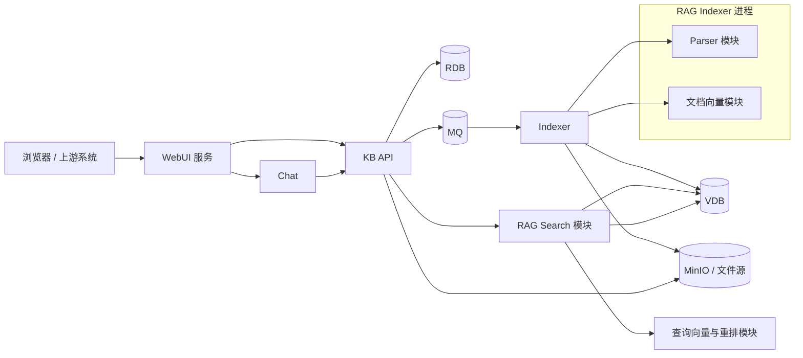
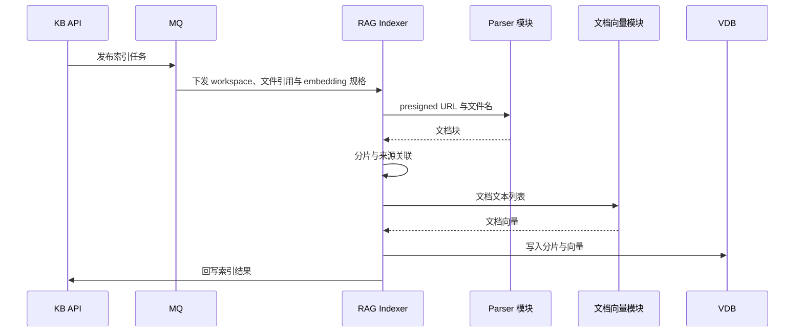
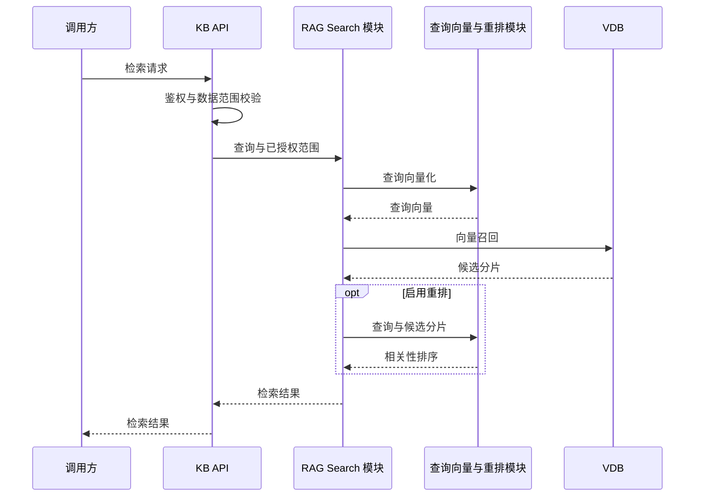

# 知识库架构

## 服务边界

应用服务为 `webui`、`kb_api`、`rag_indexer` 和 `chat`。WebUI 镜像内部使用 Nginx 托管静态文件并透明代理 KB API 与 Chat。Parser、文档 Inference 和 Search 都是 Python 模块，不拥有独立端口、健康检查、镜像或进程。KB API 管理 App、org 树、用户、workspace、权限、文件和任务状态，并在自身进程内运行 Search；索引任务通过 RabbitMQ 交给 RAG Indexer。

Indexer 位于 `kb_api/rag_indexer`，与 KB API 各自维护 `pyproject.toml`、`uv.lock`、依赖环境和 Dockerfile，共用 `kb_api/config/rag.yaml`，保留两个启动入口。两个进程通过 MQ 和结果回写 API 通信，部署均挂载同一配置目录。Indexer 只记录请求 ID，不启用 OTel 跟踪；解析和向量推理调用远程服务。

每个 App 有且只有一棵 org 树，所有组织查询都从该 App 的根组织向下加载，不跨 App。平台 `owner` 不挂组织；`admin` 和 `member` 通过 `org_id` 归属当前 App 的组织。workspace 是知识库及文件的授权边界。`workspace_user` 保存个人角色，`workspace_org` 保存组织角色，组织授权动态覆盖直属用户，个人角色优先。企业角色不隐式获得工作区内容权限。文件只关联 workspace，不关联 org。详见[工作区授权概要设计](workspace-authorization.md)。

## RAG Indexer

`rag_indexer` 只负责文档进入向量库之前的处理：

1. 从 RabbitMQ 接收带 App、workspace 和文件范围的索引任务。
2. Parser 模块读取并解析文件，输出统一文档块。
3. Indexer 根据文档结构和长度生成分片。
4. 文档向量模块调用 SiliconFlow 或 TEI 生成向量。
5. 写入 VDB，并调用 KB API 回写任务结果。

Parser 和文档向量模块与 Indexer 同进程调用，配置位于 `kb_api/config/rag.yaml`。外部调用按各自配置执行超时和重试。

两入口统一使用 `KB_CONFIG_FILE` 指定配置路径，默认读取 `kb_api/config/rag.yaml`。`inference` 和 `vector_db` 共用；`search`、`api` 用于管理与检索，`parser`、`chunking`、`storage` 用于索引。Embedding 规格属于知识库元数据，不属于服务配置。KB API 保存每个知识库的 `provider`、`model` 和 `dimensions`，创建索引任务时传给 Indexer；同一知识库不能在不重建 collection 的情况下更换模型或维度。

## RAG Search

`kb_api/rag_search` 是 KB API 内部检索模块，职责包括：

- 根据已授权的 workspace 和文件范围构建过滤条件。
- 生成查询向量并执行 dense、sparse 或 hybrid 召回。
- 去重并按配置执行 rerank。
- 返回公开检索结果。

KB API 负责鉴权、计算有权访问的工作区并在进程内调用 Search；Search 在 App 的向量 collection 中按授权后的 `workspace_ids` 和可选 `file_ids` 过滤。

## Chat

Chat 负责会话编排和模型生成，只调用 KB API，不直接访问 Search、VDB 或向量模型。

## 基础服务

| 服务 | 职责 |
| --- | --- |
| ParadeDB/PostgreSQL | App、org 树、用户、workspace 授权和文件状态；选择 PostgreSQL 向量后端时也保存分片、向量和 BM25 索引 |
| VDB | 文档分片、向量和来源元数据；可选 PostgreSQL、Qdrant 或 Milvus |
| MinIO | 原始文件对象 |
| MQ | 连接 KB API 与 RAG Indexer 的异步任务通道 |

基础服务与应用服务通过 Docker Compose 网络连接。服务边界由进程和部署单元决定，模块边界由 Python 包决定。

## 部署单元

各服务使用独立 Compose 项目，共享外部 bridge 网络 `kb-net`：

| Compose 文件 | 项目 | 命令 |
| --- | --- | --- |
| `deploy/infra.yaml` | `kb-infra` | `just infra up/down` |
| `deploy/kb.yaml` | `kb-api` | `just kb up/down/build` |
| `deploy/indexer.yaml` | `kb-indexer` | `just indexer up/down/build` |
| `deploy/chat.yaml` | `kb-chat` | `just chat up/down/build` |
| `deploy/webui.yaml` | `kb-webui` | `just webui up/down/build` |
| `deploy/tei.yaml` | `kb-tei` | `just tei up/down` |
| `deploy/mineru.yaml` | `kb-mineru` | `just mineru up/down` |

每次只传一个动作，例如 `just indexer up`。不提供 `restart/start/stop`，也没有 `app`、`bundle` 或顶层 `build` 入口。

基础服务使用 ParadeDB 镜像提供兼容 PostgreSQL 的关系数据库和默认向量后端，并包含 RabbitMQ、MinIO、OpenTelemetry Collector 和 Jaeger。Qdrant、Milvus 与 etcd 按 profile 启用，不默认启动。KB API 和 Indexer 共用 `kb_api/config/rag.yaml`；`vector_db.postgres`、`vector_db.qdrant`、`vector_db.milvus` 及云端后端中必须且只能启用一个。默认使用 PostgreSQL，向量与 BM25 数据写入 ParadeDB；选择 Qdrant 或 Milvus 时还需显式启用对应 profile。

`kb/indexer/chat/webui up` 执行 `docker compose up -d --build --force-recreate`；`infra/tei/mineru up` 执行 `up -d`，不构建镜像。WebUI、KB API、Indexer 和 Chat 的 `build` 构建各自镜像。MinerU 使用按官方方式在本地已构建的 `mineru:4`，不是官方 registry 镜像。

所有 `down` 使用对应项目的原生 Compose `down`，不删除数据、镜像或共享外部网络 `kb-net`。配置与代码变更后使用对应服务的 `up` 强制重新创建容器。
