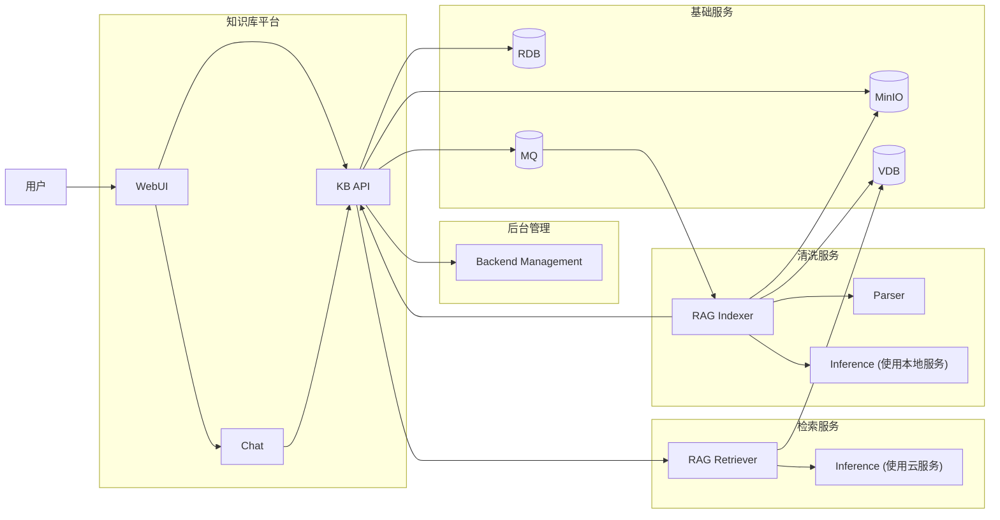
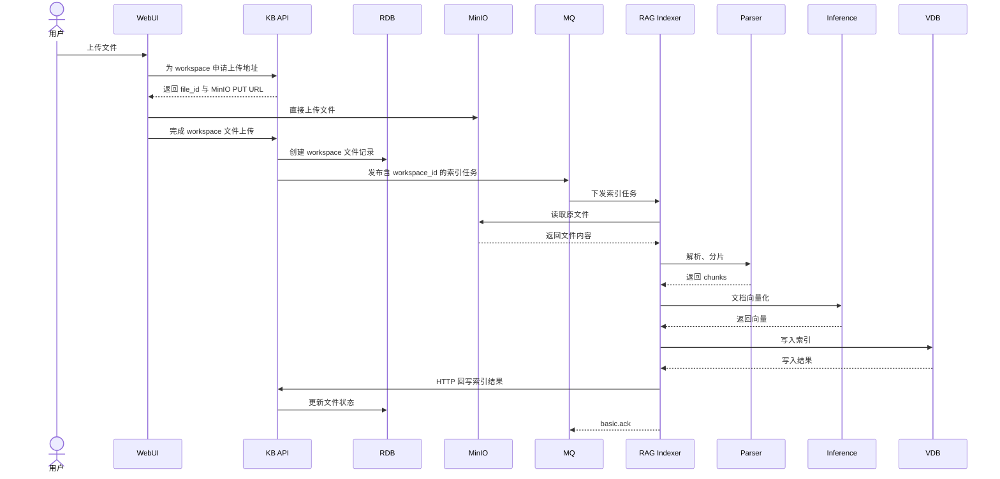
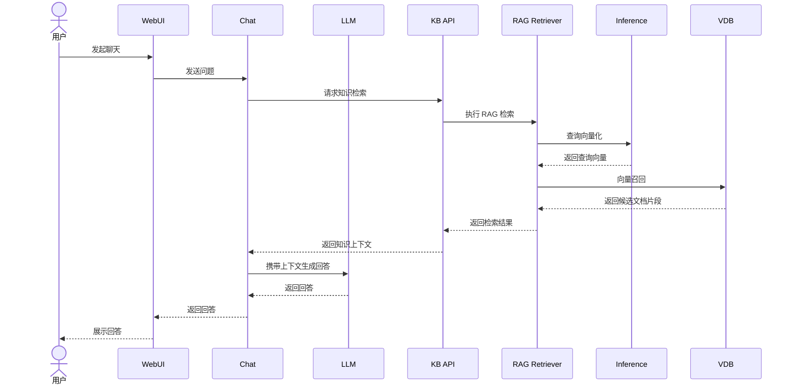

# 知识库平台架构

## 服务交互

Indexer 是纯 MQ 消费进程，不提供 HTTP API：从 `kb.index.tasks` 消费索引与删除任务，通过 HTTP 向 KB API 回写结果。

## 身份与数据范围

每个 App 对应一棵独立 org 树，界面从当前 App 根组织向下加载完整树。平台 `owner` 不挂组织；`admin` 和 `member` 通过 `org_id` 归属组织。用户登录名使用 `name`。Nginx 完成认证后向内部服务传递 `X-Org-Id`。

一个 App 可以有多个 workspace。`workspace_user` 保存个人授权与角色，`workspace_org` 保存组织授权与角色。界面选择 org 时只保存组织授权，不展开用户；该组织的直属用户动态获得访问权，不包含子组织。个人角色优先于组织角色。文件只归 workspace，上传、列表、替换、删除和检索都以 `workspace_id` 为范围。角色与操作映射详见[工作区授权概要设计](workspace-authorization.md)。

## 业务时序

### 文件上传与索引

### 聊天与检索

