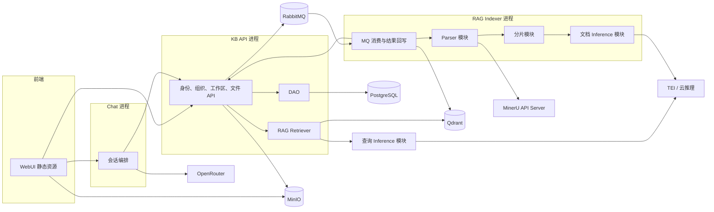
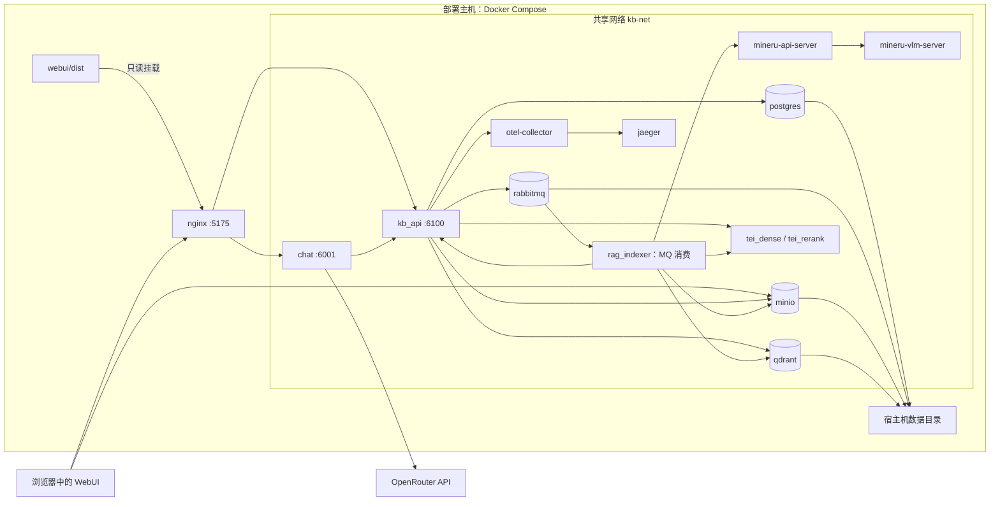
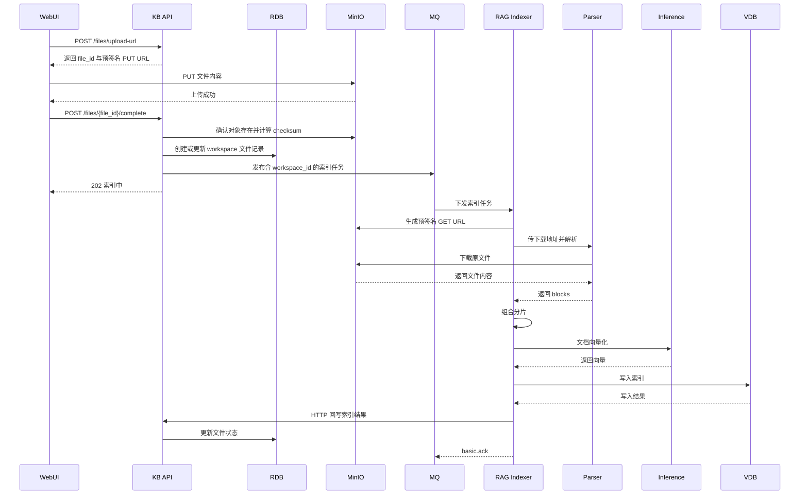
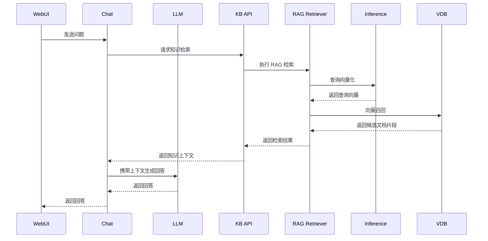

# 知识库平台架构

## 组件图



组件框表示代码职责，不代表各自拥有容器。Retriever 与查询 Inference 在 KB API 进程内；Parser、分片和文档 Inference 在 Indexer 进程内。

## 部署图



`nginx` 挂载 WebUI 构建产物；KB API、Indexer、Chat 和基础服务分别由独立 Compose 项目启动，共用外部网络 `kb-net`。图中是当前使用 Qdrant、本地 MinerU/TEI 和 OpenRouter 的部署；Milvus、etcd 不在默认启动范围内。

## 身份与数据范围

企业身份决定可以管理哪些组织和账户；工作区授权决定可以进入哪个知识库、在里面能做什么。两种角色独立，不互相继承。工作区没有独立账号，成员来自 `users` 表中的用户。

```text
App（企业）
├── orgs（组织树）── users（企业账户）
└── workspaces（知识库）
    ├── workspace_user.user_id → users.id（个人授权）
    └── workspace_org.org_id  → orgs.id（部门授权，运行时匹配直属用户）
```

每个 App 有一棵独立组织树和多个 workspace。界面从当前 App 根组织向下展示完整树，但看到组织不等于能管理它。平台 `owner` 不挂组织；企业 `admin` 和 `member` 通过 `users.org_id` 归属组织。用户登录名使用 `name`。Nginx 完成认证后向内部服务传递 `X-Org-Id`。

### 企业身份

| 身份 | 管理范围与操作 | 不会自动获得的权限 |
| --- | --- | --- |
| 平台 `owner` | 创建企业；管理全平台的组织和账户；创建或删除工作区 | 未授权工作区的文件访问权 |
| 企业 `admin` | 查看本企业完整组织树；管理所属组织及下级的组织和账户，包括重置这些用户的密码；在本企业创建工作区 | 其他工作区的成员身份和内容权限 |
| 企业 `member` | 查看本企业完整组织树；在本企业创建工作区；修改自己的密码 | 组织及他人账户的管理权、其他工作区的访问权 |

用户创建工作区时，系统写入一条 `workspace_user` 个人 `admin` 授权。这是创建动作产生的授权，不是企业 `admin` 或 `member` 自动转换为工作区角色。企业 `admin` 不能仅凭企业身份管理其他工作区。平台 `owner` 可删除工作区，但未获授权时仍不能读取其中的文件。

### 成员来源

| 来源 | 保存方式 | 实际生效的用户 | 可授予的工作区角色 |
| --- | --- | --- | --- |
| 创建工作区 | `workspace_user(workspace_id, 创建者 user_id, admin)` | 创建者本人 | 自动 `admin` |
| 添加个人 | `workspace_user(workspace_id, user_id, role)` | 指定的企业用户 | `admin`、`editor`、`viewer` |
| 添加部门 | `workspace_org(workspace_id, org_id, role)` | 该部门当前的直属用户，不包含子部门 | `editor`、`viewer` |

部门授权不展开写入 `workspace_user`，人员调入或调出后按当前组织归属动态生效。同一用户同时命中个人与部门授权时，个人授权优先。未命中授权的用户不是该工作区成员。账号停用、所属组织链停用或跨企业时也不能凭原授权访问。

### 工作区权限

| 有效角色 | 可执行操作 |
| --- | --- |
| `admin` | 管理工作区信息、成员和全部文件；删除工作区还要求本人是创建者，平台 `owner` 例外 |
| `editor` | 阅读、搜索、上传；只能替换或删除自己上传的文件 |
| `viewer` | 阅读、搜索 |

例如王五在企业中是 `member`，创建工作区 A 后成为 A 的 `admin`；技术部被授予工作区 B 的 `viewer` 时，王五在 B 只能阅读和搜索。A 的权限不会传到 B，也不会让王五获得企业账户管理权。文件只归属 workspace，不归属 org；文件上传、列表、替换、删除和检索均以工作区为权限边界。详细操作映射见[工作区授权概要设计](workspace-authorization.md)。

## 业务时序

### 文件上传与索引



### 聊天与检索


